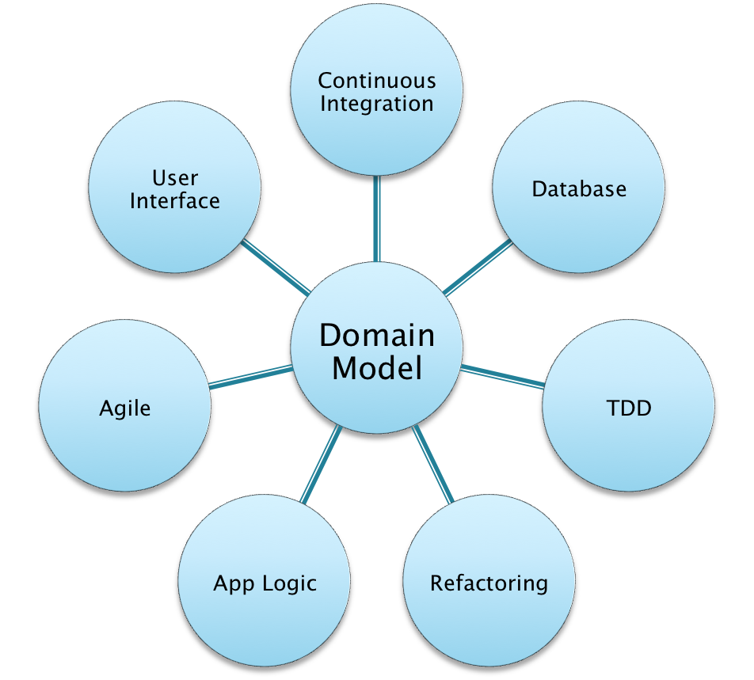
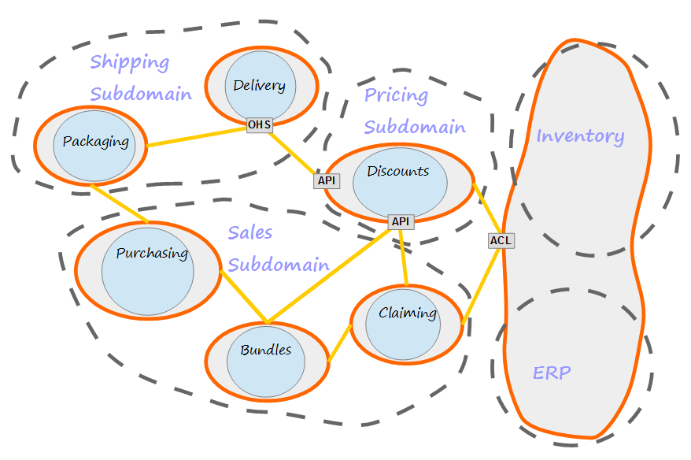
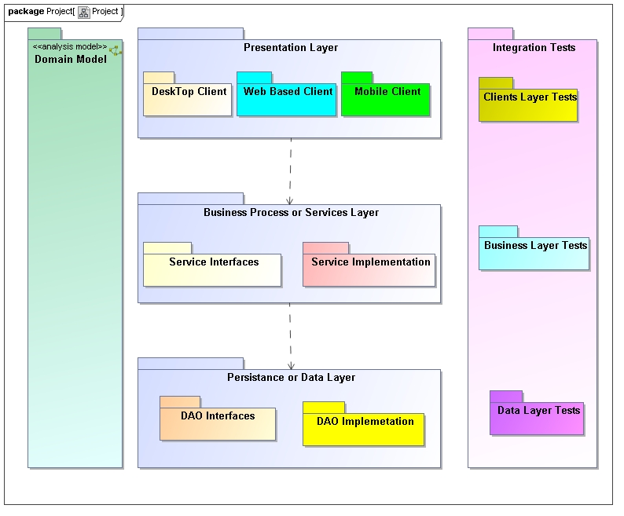

# Chapter 6: Domain Driven Design 
## Chapter Objectives
1. Understand what Domain Driven Design is and when and why it is valuable to software intensive organizations.
2. Describe how the principle of separation of concerns ” has been applied to the main system design
3. Know the the basic principles and processes needed to develop the useful sort of models, tie them into
implementation and business analysis, and place them within a viable, realistic strategy.
4. Context Mapping: A pragmatic approach to dealing with the diversity models and processes on real large
projects with multi-team/multi-subsystem development.
5. Combining the Core Domain and Context Map to illuminate Strategic Design options for a project.

## Introduction
Domain Driven Design (DDD) is an approach of how to model the core logic of an application. Eric Evans, in his book, **Domain Driven Design**, coined the term.
A domain, a sphere of knowledge, influence, or activity is a subject area to which the user applies a program is the domain of the software.

Ideally, your software should directly reflect the Domain and the Domain-Logic of the business problem you want to solve with your application. This helps with understanding the problem as well as the implementation. This, also, further increases maintainability of the software that is developed.

For most applications, the core concept is the domain model, which is the actual representation of how the business works.The critical complexity of most software projects is in understanding the domain itself.

The Domain Driven Design approach introduces common principles and patterns that should be used when modelling your Domain. The approach not only provides building blocks used used to build a domain model, but also  principles that help to have a supple design in your implementation.

According to Evans, Domain-driven design flows from the premise that the heart of software development is knowledge and understanding of the subject matter. The complexity that we should be tackling is the complexity of the domain itself and  not the technical architecture, not the user interface, not even specific features. This means designing everything around our understanding and conception of the most essential concepts of the
business and justifying any other development by how it supports that core.

Domain  means the area of interest in the business. When you are developing a system to automate activities, you are actually modeling that business. The abstractions that you design, the behaviors that you implement, the UI interactions that you build, all reflect the business. This constitutes the model of the domain.

Formally, a domain model is a blueprint of the relationships between the various entities of the problem domain and sketches out other important details, such as

* Objects that belong to the domain. E.g. for the banking domain, you have objects like Bank, Account, Transactions etc. 
* Behaviors that those objects demonstrate in interacting among themselves. E.g. in a banking system you debit from an Account, you issue a Statement to your client. These are some typical interactions that occur between the objects of a domain. 
* The language that the domain speaks. When you are modeling the domain of personal banking, terms like Debit, Credit, Portfolio or phrases like transfer R 100 from Account 1 to Account 2” occur quite ubiquitously and form the vocabulary of the domain. 
* The context within which the model operates, which includes the set of assumptions and constraints which are relevant to the problem domain and are automatically applicable for the software model that you develop. A new bank account can be opened for a living person or entity only – this can be one of the assumptions that define a context of our domain model for personal banking.

## Challenges of Domain Driven Design

Like any other modeling exercise, the most challenging aspect of implementing a domain model is to manage its complexity. Some of these complexities are inherent to the problem, you really cannot avoid them. These are called the essential complexities of the system. E.g. when you apply for a personal loan in your bank, determining the eligibility of amount depending on your profile has a fixed complexity that is determined by the core business rules of the domain. This is an essential complexity that you cannot avoid in your solution model.

But some complexities are often introduced by the solution itself, e.g. we implement a new banking solution that introduces extraneous load on operations in the form of additional batch processing. These are known as the incidental complexities of the model.

One of the essential ideas of an efficient model implementation is to reduce the amount of incidental complexity. And more often than not, we find that you can reduce the incidental complexities of a model by adopting techniques that help you manage complexities better.

For example, if your technique leads to better modularization of your model, then your final implementation is not a single monolithic unmanageable piece of software. It’s actually decomposed into multiple smaller components, each of which functions within its own context and assumptions. With a modular system each component is self-contained in functionality. And interacts with other components only through explicitly defined contracts, which we call the context boundaries. This helps manage complexity better than a monolithic system.

## Ubiquitous Language

Ubiquitous language is a set of terms describing all aspects of the domain that are understood by both the domain experts and the developers. This language is expressed in a living document that should be created as early as possible and continuously referred to by functional and technical teams. The ubiquitous language facilitates discussions with the domain experts and discovers key domain concepts used in the domain model. The figure below illustrates how ubiquitous language is viewed by all the stakeholders

The consistent use of unambiguous language is essential in understanding and communicating insights discovered in the domain. In DDD, it is less about the nouns and verbs and more about the concepts. It is the intention of the concept, its significance and value that is important to understand and convey. How that
intention is implemented is valuable, but for every intention,there are many implementations. 

Everyone must use the language everywhere and at every opportunity to understand and share these concepts and intentions. When you work with a ubiquitous
language, the collaboration with domain experts is more creative and valuable for everyone.

In summary ubiquitous language	is a language structured around the domain model and used by all team members to connect all the activities of the team with the software.

## Domain Model
At the center of Domain driven Design is a Domain Model as shown in the diagram below 

A model is a system of abstractions that describes selected aspects of a domain and can be used to solve problems related to that domain.It is from the ubiquitous language that conceptual elements are, which are the building blocks of a Domain Model are captured.

The Domain Model is formed first as an analysis model through the collaboration between a development team and business experts. It represents a view, not the reality, of the problem domain designed only to meet the needs of business use cases. It is described in a ubiquitous  language that the team speaks and the diagrams that the team sketches.

Please note that the domain represents the problem area you are working within. It is the firm reality of the situation. The domain model, on the other hand, is an abstraction of the problem domain, expressed as a UML artifact or code implementation that represents a view, not the reality, of the problem.

## Conceptual Elements in a Domain Model

The elements that make up the Domain Model are divided into three key categories

1. Life Cycle Elements
2. Structural Elements
3. Behaviour Elements

---

### Life Cycle Elements

#### FACTORIES

It is always a good practice to have dedicated abstractions that handle various parts of the your domain lifecycle. Instead of littering the entire code base with snippets of the code that creates your object, centralize them using a pattern. This serves two purposes:
* It keeps all creation code in one place 
* It abstracts the process of creation of an entity from the caller

As an example, you can have an account factory that takes the various parameters needed to create an account and hands you over a newly created account. The new account that you get back from the factory may be a checking, savings or money market account depending on the parameters you pass. So the factory lets you create different types of objects using the same API. It abstracts the process and the actual type of created objects.

The creation logic resides within a factory. But where does the factory belong? A factory after all provides you a service – the service of creation and possible initialization. It’s the responsibility of the factory to hand you over a
fully constructed minimally valid instance of the domain object. One option is to make the factory part of the module that defines the domain object, e.g using the Builder Design Pattern.

#### REPOSITORIES

A Repository gives you this interface for parking an aggregate in some persistent form so that you can fetch it back to an in memory entity representation when you need it. Usually a repository has an implementation based on some persistent storage like an RDBMS, though the contract doesn’t enforce that too. Also note that the persistent model of the aggregate may be entirely different from the in-memory aggregate representation and is mostly driven by the underlying storage data model. It’s the responsibility of the repository to provide you the interface to manipulate entities from the persistent storage without exposing the underlying relational (or whatever model the underlying storage supports) data model.

Note that the interface for a repository doesn’t have any knowledge about the nature of the underlying persistent store. It can be a relational database or a NoSQL database – only the implementation knows that. So what an aggregate offers for in memory representation of the entity, a repository does the same for the persistent storage. An aggregate hides the underlying details of the in-memory representation of the object, while a repository abstracts the underlying details of the persistent representation of the object.

---

### Structural Elements

#### Entity
An entity represents a concept in your domain that is defined by its identity rather than its attributes. Although an entity’s identity remains fixed throughout its lifecycle, its attributes may change. An entity is responsible for defining what it means to be the same; in code this is often achieved by overriding the equality operations of a class.

####Value Objects
Value objects are lightweight, immutable objects that have no identity.
Value objects represent the elements or concepts of your domain that are known only by their characteristics; they are used as descriptors for elements in your model; they do not require a unique identity. Because value objects have no conceptual identity within the model, they are defined by their attributes; their attributes determine their identity. Value objects don’t need identity because they are always associated with another object and are therefore understood
within a particular context. 

Please note that since Value Objects  are defined by their attributes, they are s are treated as immutable; that is, once constructed, they can never alter their state.

#### Service Objects

Services are best described as processes that don’t “belong” to any domain entity, but may operate on those entities. A service operates on one or many aggregates at once from the outside, in order to achieve some overall goal.

Service Objects  have no identity or state; their responsibility is to orchestrate business logic using entities,  value objects, factories and events objects. Services should mostly be instantiated  as Singletons.

As an example from the banking system, a customer comes to the bank or the ATM and transfers money between 2 accounts. This results in a debit from one account, credit to another, which will reflect as a change in balance in the respective accounts. There are some validation checks to be done, whether the accounts are active or not, whether the source account has enough funds to transfer and so on. Note in every such interaction you may have many domain elements involved, both entities and value objects.

#### Aggregates

Entities and value objects collaborate to form complex relationships that meet invariants( Business rules that enforce consistency in the domain model) within the domain model. When dealing with large interconnected associations of objects, it is often difficult to ensure consistency and concurrency when performing actions against domain objects.

As we add more to a model, the object graph can become quite large and
complex. Large object graphs make technical implementations such as
transaction boundaries, distribution, and concurrency very difficult.

Trying to treat this collection of objects as one conceptual whole is difficult and could result in performance problems for an application.

Domain‐Driven Design has the Aggregate pattern to ensure consistency and to define transactional concurrency boundaries for object graphs. Large models are split by invariants and grouped into aggregates of entities and value objects that are treated as a conceptual whole.

Aggregates are consistency boundaries such that the classes inside the
boundary are “disconnected” from the rest of the object graph. Each
aggregate has one entity which acts as the “root” of the aggregate.

When creating aggregates, ensure that the aggregate is still treated
as a unit that is meaningful in the domain. Also, test the correctness
of the aggregate boundary by applying the “delete” test. In the delete
test, critically check which objects in the aggregate (and outside the
aggregate) will also be deleted, if the root was deleted.

Follow these simple rules for aggregates:
	 * The root has global identity and the others have local identity
	 * The root checks that all invariants are satisfied
	 * Entities outside the aggregate only hold references to the root
	 * Deletes remove everything in the aggregate 
	 * When an object changes, all invariants must be satisfied.

#### Events Objects

An event represents something meaningful in the domain has occurred and is usually in the past tense such as OrderCreated or OrderLineAdded, EmployeeHired, EmployeeNameChanged , EmployeePayGradeChanged, EmployeeTerminated, etc. Events are immutable in that they represent something that happened at a particular point in time and they are persistent, meaning stored in storage such as a database.

Domain Event are used to capture an occurrence of something that happened in
the domain at a particular point in time and as such they need to have a mandatory time stamp. 

Domain Events are representative of the history of events in the system and these can never be changed. Domain Events.

The Domain Event should have an Identity, Timestamp and Event value, at least

### Behaviour Elements
 
 The Behavior elements are usually the Design patterns from the GOF, in particular, the Composite, Strategy pattern.
 
 
 See Design patterns notes.

## Context and Bounded Context

The domain Model and its relationships live in a Context. The Context, in general,  refers to the specific responsibility of the model, which helps to decompose and organize the problem space. Each Domain Model has a context implicitly defined within a Domain or Subdomain. When communicating with domain experts or other members of the development team, you should ensure that everyone is aware of the context you are talking in. The context defines the scope of the model, limiting the boundaries of the problem space, enabling the team to focus without distractions.

Each of these contexts are, in software DDD terms,  called Bounded Contexts. A bounded context takes the idea of a model in context further by encapsulating it within a boundary of responsibility. This boundary is a concrete technical implementation, as opposed to the context that is more abstract. The bounded context enforces communication in such a manner as to not lessen the purity of the model.

Treat bounded contexts like the borders of a country. Nothing should pass into
the bounded context unless it goes through the border control and is valid. Just
like countries where people speak a different language, so does the code within
the bounded context. Be on your guard for people trying to breach your border. 

One of the most important parts of DDD is the protection of boundaries. A model is defined in a context. This should be followed through to the implementation in the code.

These Bounded Contexts are put together to form a large application. 

## Context Mapping

In large and complex applications, multiple Domain Models in different Context, living in different Sub Domains,  collaborate to fulfill the requirements and behaviors of a system. A Context may not own all of the various models of a system.

Context mapping is a design process where the contact points and translations between bounded contexts are explicitly mapped out.

Keep in mind that a context Map is mainly the tool used to make context boundaries explicit and is not primarily technical, but rather a tool to expose the politics of the organizations and the teams building the systems

Contexts can be created from (but not limited to) the following:
*  How teams are organized
*  The structure and layout of the code base
*  Usage within a specific part of the domain

Aim for consistency and unity inside the context, and don’t be distracted
by how the model is used outside the context. Other contexts will have
different models with different concepts. It is not uncommon for another
context to use a different dialect of the domain’s ubiquitous language

Models in context work together in large applications to provide system behavior. It is important to understand the relationships between the contexts to have a clear understanding as to the lay of the land. The following patterns describe common relationships between bounded contexts. Note that these patterns show how the models relate to each other and how teams relate. They are no technical integration patterns on communicating across contexts.

1. Shared Kernel
2. Customer Supplier Development Team
3. Conformist
4. Anti-Corruption Layer
5. Separate Ways

### Shared Kernel

If two teams are working closely in the same application, on two separate bounded contexts that have a lot of crossover in terms of domain concepts and logic, the overhead of keeping the teams isolated and using translation maps to translate from one context to another can be too much. In this instance, it may be better to collaborate and to share part of the model to ease integration. This shared model is known as a shared kernel. The pattern is of particular use if you have two bounded contexts in the same subdomain that share a subset of domain logic.

### Customer Supplier Development Team
 
The relationships between bounded contexts can be defined in terms of a direction; one end will be upstream and the other downstream. 

If you are the downstream end of the relationship you are dependent on data or behavior of the upstream end. The upstream end will influence the downstream context. 

For instance, if an upstream interface changes so must the consuming side downstream. Likewise the release plan of the upstream part of the relationship will influence the downstream context as it may be dependent on a particular API method. 
 
In situations where teams are not working toward a common goal to avoid the upstream team making all the decisions and potentially compromising the downstream team to the detriment of the project as a whole, a more collaborative customer‐supplier relationship can be formed.

In this pattern, the teams work together to create an agreed‐upon interface that satisfies both from a technical and scheduling standpoint. The customer part of the relationship is the downstream context. The customer will join the supplier’s (upstream context) planning meeting to ensure its needs are understood and that it can have visibility when upstream changes are occurring.

### Conformist

If an upstream context is not able to collaborate then the downstream context will need to conform to the upstream context when integrating. The most common occurrence of the conformist relationship is integrating with external suppliers.

If you are downstream and are unable to form a customer‐supplier relationship and it is too costly to create an anti-corruption layer you should conform to the model of the provider to simplify integration. 

The most obvious downside to the conformist relationship is that the downstream team, which works to the requirements of the upstream team, may have to sacrifice clarity of its domain model because it must align to the model of the upstream context even though it may be conceptually different than your own view.

### Anti-Corruption Layer

If you are creating a model for a sub system that communicates with other sub systems as part of a larger system you may need to interface with models created by different teams. Other models, even though created for the same domain, can be expressed with a different ubiquitous language and modeled in a completely different manner to your own. If you are not careful integrating with these
models, adapting to their interfaces can lead to a corruption of your model.

In order to avoid corruption and protect your model from external influences you can create an isolation layer that contains an interface written in terms of your model. The interface adapts and translates to the interface of the other context. This isolation layer is known as an anti corruption layer.

The anti corruption layer’s translation map works in a similar manner to the adapter pattern in that it transforms the API of another context into an API that you can work against.

### Open Host Service
Other systems or components that communicate with you will employ some type of transformation layer in order to translate your model into terms of their own, similar to the anticorruption layer.

If multiple consumers share the same transformation logic it can be more useful to provide a set of services that exposes the functionality of a context via a clearly defined, explicit contract known as an open host service.

### Separate Ways

If the cost of integration between contexts is too great due to technical complexities or political ones,a decision can be made to not integrate contexts at all and simply have teams implement separately from one another. Integration can instead be achieved via user interfaces or manual processes. 

For example, it may be useful for a customer service application that manages contacts with customers to also show users the orders a customer has outstanding when dealing with a query. However, if the effort of integration between an order management system is too great it may be more practical to simply include a menu link that enables the Order Management system to be opened in a separate
screen, thus giving users the information they need without the complexities of fully integrating albeit for a small de‐scope in feature request.

# Application Architectures

Domain-Driven Design (DDD) focuses on managing the challenges of building applications with complex domain logic by isolating the business complexities from the technical concerns.

Up until now, we have only looked at techniques to enable teams to model a useful
conceptual abstraction of the problem domain. The rest of this chapter looks at  patterns that enable the domain model to be utilized in the context of an application, taking into consideration persistence, presentation, and other technical requirements.

Developing software while following the principles of DDD does not require you to use any particular application architecture style. But one thing that your architecture must support is the isolation of your domain logic.

It is vital that the structure of an application supports the separation of technical complexities from the complexities of the domain. Presentation,
persistence, and domain logic concerns of an application will change at different rates and for different reasons; an architecture that separates these concerns can accommodate change without causing an undesired effect to unrelated areas of the codebase.

In addition to a separation of concerns, an application architecture must abstract away from the intricacies of a complex domain by exposing a coarse-grained set of use cases that encapsulate and hide the low-level domain details. Abstracting at a higher level prevents changes in domain logic from affecting the presentation layer and vice versa because the clients of the application communicate through application services acting as use cases rather than directly with domain
objects.

There are several Architectures that are in common use today and these are 

* A Layered Architecture
* Event Driven Architecture
* Micro Kernel Architecture
* Micro Services Architecture
* Space-Based Architectures

## A Layered Architecture

A layered architecture can be used to isolate the domain from other parts
of the system and can be arranged in different formats.

Each layer is aware of only those layers below it. As such, a layer at a
lower level cannot make a call (i.e. send a message) to a layer above
it. Also, each layer is very cohesive and classes that are located in
a particular layer pay strict attention to honoring the purpose and
responsibility of the layer.

Layers should be designed with interfaces and these interfaces should be used 
for intercommunication between layers. Also, let the code using the domain
layer control the transaction boundaries.

## Event Driven Architecture

## Micro Kernel Architecture

## Micro Services Architecture

## Space-Based Architectures

